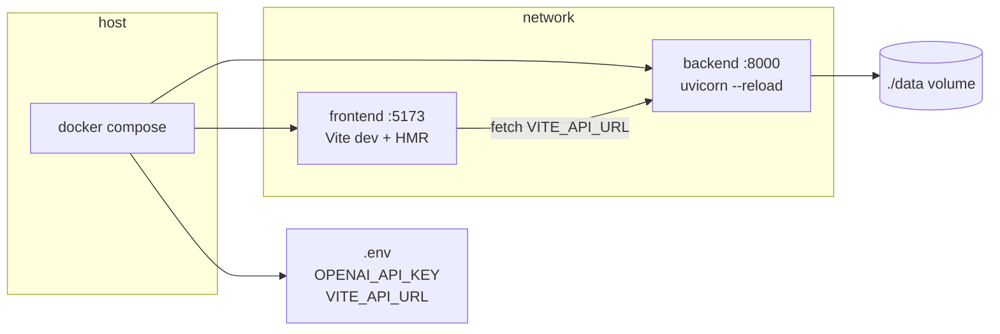

# feat: Initial project scaffold — Docker Compose, backend, frontend

## Summary

Bootstrap the greenfield PDF Summary AI monorepo so `docker compose up` starts a hot-reloading FastAPI backend on `:8000` and a Vue 3 + Naive UI frontend on `:5173`, with the locked directory layout, environment contract, and `./data` persistence in place. This plan covers scaffolding only — upload, vision pipeline, and job processing are deferred to follow-up plans.

---

## Problem Frame

The repo has requirements and agent skills but no application code, Dockerfiles, or Compose file. The COXIT take-home expects a runnable Docker setup and meaningful commits; step 1 of the origin implementation order is proving both services start before building the PDF pipeline (see origin: `docs/solutions/architecture-patterns/pdf-summary-ai-requirements-2026-05-24.md`).

---

## Requirements

- R1. Create the monorepo layout defined in origin §15 (`backend/`, `frontend/`, `data/`, root compose).
- R2. Backend runs FastAPI on port 8000 with uvicorn `--reload` inside Docker.
- R3. Frontend runs Vue 3 + Vite + Naive UI on port 5173 with HMR inside Docker.
- R4. `docker compose up` from repo root starts both services without manual steps beyond copying `.env.example` → `.env`.
- R5. Backend CORS allows `http://localhost:5173`.
- R6. `./data` volume persists across container restarts; directory is gitignored.
- R7. `.env.example` documents `OPENAI_API_KEY` and `VITE_API_URL`.
- R8. README includes Docker quick-start (expand existing README, keep link to requirements doc).
- R9. Backend app package structure matches origin (routers, models, services, workers) as importable stubs — ready for feature work without restructuring.
- R10. Frontend can reach backend (connectivity smoke via a minimal fetch or displayed status).

---

## Scope Boundaries

- Full PDF upload, validation, SQLite models, OpenAI vision pipeline, job worker, history UI
- Automated tests, CI/CD, `/health` endpoint, auth, delete/retry endpoints
- Production single-container image
- Populating `backend/app/services/openai.py` beyond an empty stub module

### Deferred to Follow-Up Work

- **Upload + validation + SQLite models:** separate plan / next `ce-work` session (origin step 2)
- **Vision extraction + summary pipeline:** separate plan (origin steps 3–4)
- **Frontend upload/polling/history UI:** separate plan (origin step 5)
- **Full README API table + Loom script:** after API endpoints exist (origin step 6)

---

## Context & Research

### Relevant Code and Patterns

- Greenfield repo — no existing app code to mirror
- `README.md` — points to requirements doc as source of truth
- `.gitignore` — Python template present; needs `data/` and `node_modules/` per origin §15
- Commit style — conventional (`docs: ...`, `feat: ...`)

### Institutional Learnings

- `docs/solutions/architecture-patterns/pdf-summary-ai-requirements-2026-05-24.md` — locked stack, layout, ports, env vars, explicit out-of-scope list
- Suggested build order step 1: Docker skeleton + both services healthy

### External References

- Skipped — origin doc and `.agents/skills/docker-compose-orchestration/` provide sufficient guidance for standard FastAPI + Vite split-compose pattern

---

## Key Technical Decisions

- **Split Compose over monolith:** Matches origin §14 (hot reload in dev); frontend and backend as separate services on a shared bridge network (see origin: Docker Option D).
- **Backend data path inside container:** Mount host `./data` to a fixed in-container path (e.g. `backend/app/data` or `/app/data`) and read `DATA_DIR` from env — keeps upload/SQLite paths consistent when feature work lands.
- **Stub connectivity over `/health`:** Origin excludes a dedicated health endpoint; use `GET /` or `GET /api/` returning JSON for smoke checks instead.
- **Scaffold all package dirs now:** Create `models/`, `routers/`, `services/`, `workers/` with `__init__.py` (and empty stub modules where origin names files) to avoid a restructuring commit later.
- **Naive UI at scaffold time:** Install and configure in the Vite shell now — cheaper than retrofitting after building UI (see origin §13).
- **No test harness:** Origin §16 explicitly excludes automated tests for v1.

---

## Open Questions

### Resolved During Planning

- **Scope of this plan:** Initial scaffold only (user request: "project structure docker compose and .."), not full take-home feature set.
- **Health endpoint:** Omit; use root JSON stub per origin out-of-scope list.

### Deferred to Implementation

- **Exact in-container `DATA_DIR` path:** Choose during U2 based on Dockerfile `WORKDIR`; document in `.env.example`.
- **Frontend proxy vs direct `VITE_API_URL`:** Use env-based API URL (origin §14); Vite dev server does not need a proxy if CORS is configured on backend.

---

## Output Structure

```
/
├── backend/
│   ├── app/
│   │   ├── __init__.py
│   │   ├── main.py
│   │   ├── config.py
│   │   ├── models/
│   │   │   └── __init__.py
│   │   ├── routers/
│   │   │   ├── __init__.py
│   │   │   └── root.py          # stub JSON route
│   │   ├── services/
│   │   │   ├── __init__.py
│   │   │   └── openai.py        # empty stub
│   │   └── workers/
│   │       └── __init__.py
│   ├── requirements.txt
│   └── Dockerfile
├── frontend/
│   ├── Dockerfile
│   ├── index.html
│   ├── package.json
│   ├── vite.config.ts
│   ├── tsconfig.json
│   ├── tsconfig.node.json
│   └── src/
│       ├── main.ts
│       ├── App.vue
│       ├── env.d.ts
│       └── components/
│           └── BackendStatus.vue  # optional connectivity indicator
├── data/                          # gitignored; created by compose or runtime
├── docker-compose.yml
├── .env.example
└── README.md                      # expanded quick-start
```

---

## High-Level Technical Design

> *This illustrates the intended approach and is directional guidance for review, not implementation specification. The implementing agent should treat it as context, not code to reproduce.*



**Compose service shape (directional):**

| Service | Build context | Ports | Volumes | Command |
|---------|---------------|-------|---------|---------|
| `backend` | `./backend` | `8000:8000` | `./backend/app` (bind), `./data` (bind) | uvicorn with reload |
| `frontend` | `./frontend` | `5173:5173` | `./frontend` (bind) | Vite dev server |

---

## Implementation Units

- U1. **Environment and repo hygiene**

**Goal:** Establish env contract, gitignore rules, and runtime data directory conventions before application code lands.

**Requirements:** R1, R6, R7

**Dependencies:** None

**Files:**
- Create: `.env.example`
- Modify: `.gitignore`
- Modify: `README.md` (stub quick-start section — completed in U5)

**Approach:**
- Add `data/`, `node_modules/`, `.env` to `.gitignore` (if not already present)
- `.env.example` keys: `OPENAI_API_KEY=`, `VITE_API_URL=http://localhost:8000`, optional `DATA_DIR=./data`
- Document that `data/` is created at runtime and holds uploads + SQLite later

**Patterns to follow:**
- Origin §14–15 env and gitignore conventions

**Test scenarios:**
- Test expectation: none — config-only unit (origin §16)

**Verification:**
- `.env.example` exists with documented keys
- `data/` and `node_modules/` are gitignored

---

- U2. **Backend FastAPI skeleton and Dockerfile**

**Goal:** Runnable FastAPI app with locked package structure, CORS, and stub root route inside a Docker image.

**Requirements:** R2, R5, R9

**Dependencies:** U1

**Files:**
- Create: `backend/Dockerfile`
- Create: `backend/requirements.txt`
- Create: `backend/app/__init__.py`
- Create: `backend/app/main.py`
- Create: `backend/app/config.py`
- Create: `backend/app/models/__init__.py`
- Create: `backend/app/routers/__init__.py`
- Create: `backend/app/routers/root.py`
- Create: `backend/app/services/__init__.py`
- Create: `backend/app/services/openai.py` (stub only)
- Create: `backend/app/workers/__init__.py`

**Approach:**
- Python 3.12 slim base image
- Pin core deps: `fastapi`, `uvicorn[standard]`, `python-multipart` (needed later for upload), `pymupdf` (needed later for PDF — install now to avoid Dockerfile churn)
- `main.py`: create app, add CORS for `http://localhost:5173`, include root router
- `config.py`: read env vars (`OPENAI_API_KEY`, `DATA_DIR`) via pydantic-settings or simple os.getenv
- `routers/root.py`: `GET /` returns JSON e.g. `{"service": "pdf-summary-ai", "status": "ok"}`
- Dockerfile: `WORKDIR /app`, copy requirements, install, copy app, expose 8000

**Patterns to follow:**
- Origin §15 backend layout
- `.agents/skills/fastapi/` conventions for app factory pattern

**Test scenarios:**
- Test expectation: none — origin excludes automated tests for v1

**Verification:**
- `docker build -f backend/Dockerfile backend/` succeeds
- Running container responds on `GET /` with JSON 200

---

- U3. **Frontend Vue 3 + Vite + Naive UI skeleton and Dockerfile**

**Goal:** Runnable frontend shell with Naive UI configured and a visible connectivity check to the backend.

**Requirements:** R3, R10

**Dependencies:** U1

**Files:**
- Create: `frontend/Dockerfile`
- Create: `frontend/package.json`
- Create: `frontend/vite.config.ts`
- Create: `frontend/tsconfig.json`
- Create: `frontend/tsconfig.node.json`
- Create: `frontend/index.html`
- Create: `frontend/src/main.ts`
- Create: `frontend/src/App.vue`
- Create: `frontend/src/env.d.ts`
- Create: `frontend/src/components/BackendStatus.vue`

**Approach:**
- Scaffold with `npm create vite@latest` pattern (Vue + TypeScript)
- Add `naive-ui` dependency; register in `main.ts`
- `vite.config.ts`: bind `0.0.0.0:5173` for Docker; read `VITE_API_URL` from env
- `App.vue`: title "PDF Summary AI", placeholder upload area (disabled or "coming soon"), embed `BackendStatus`
- `BackendStatus.vue`: fetch `${VITE_API_URL}/` on mount; show connected/error state via `NAlert` or `NTag`
- Dockerfile: Node 20, install deps, `CMD` runs Vite dev with `--host 0.0.0.0`

**Patterns to follow:**
- Origin §13 Naive UI component choices
- `.agents/skills/vue/` and `.agents/skills/vite/` for script setup + Vite 8 patterns

**Test scenarios:**
- Test expectation: none — origin excludes automated tests for v1

**Verification:**
- `docker build -f frontend/Dockerfile frontend/` succeeds
- App renders title and backend status indicator in browser

---

- U4. **Docker Compose orchestration**

**Goal:** Single-command dev environment with hot reload and shared data volume.

**Requirements:** R4, R6

**Dependencies:** U2, U3

**Files:**
- Create: `docker-compose.yml`

**Approach:**
- Services: `backend`, `frontend`
- `backend`: build `./backend`, ports `8000:8000`, volumes bind-mount source for reload + `./data:/app/data`, env_file `.env`, pass `OPENAI_API_KEY` and `DATA_DIR`
- `frontend`: build `./frontend`, ports `5173:5173`, volumes bind-mount `./frontend` (exclude `node_modules` via anonymous volume if needed), env `VITE_API_URL=http://localhost:8000`
- `depends_on: backend` for frontend (ordering only — frontend should degrade gracefully if backend slow)
- Ensure `./data` exists or is created on first run

**Patterns to follow:**
- Origin §14 split-container hot reload
- `.agents/skills/docker-compose-orchestration/`

**Test scenarios:**
- Test expectation: none — infrastructure-only unit

**Verification:**
- `cp .env.example .env && docker compose up --build` starts both services without errors
- `http://localhost:8000/` returns JSON
- `http://localhost:5173/` loads Vue app with backend connected status
- Restarting compose preserves `./data` contents

---

- U5. **README quick-start and end-to-end smoke verification**

**Goal:** Document how to run the scaffold and confirm the milestone is complete.

**Requirements:** R8, R10

**Dependencies:** U4

**Files:**
- Modify: `README.md`

**Approach:**
- Add sections: Prerequisites (Docker, OpenAI key for later), Quick Start (`cp .env.example .env`, `docker compose up --build`), Services table (ports), Project Structure (link to requirements doc)
- Note scaffold status: pipeline not yet implemented
- Manual smoke checklist: both URLs load, frontend shows backend connected

**Patterns to follow:**
- Origin README expectations (partial — full API docs deferred)
- Existing README link to requirements doc

**Test scenarios:**
- Test expectation: none — documentation unit

**Verification:**
- README instructions are sufficient for a fresh clone to run compose
- Manual smoke passes on developer machine

---

## System-Wide Impact

- **Interaction graph:** Frontend → backend root stub only; no DB, worker, or OpenAI calls yet
- **Error propagation:** Frontend connectivity component should show user-visible error if backend unreachable; no crash
- **State lifecycle risks:** `./data` volume must not be committed; ensure gitignore before first commit with data dir
- **API surface parity:** Stub `GET /` only — full 4-endpoint API deferred
- **Integration coverage:** Manual browser + curl smoke; no automated integration tests per origin
- **Unchanged invariants:** Requirements doc remains source of truth; no features from out-of-scope list added

---

## Risks & Dependencies

| Risk | Mitigation |
|------|------------|
| Vite HMR slow inside Docker on macOS | Bind-mount source; document if needed; acceptable for take-home |
| `node_modules` bind-mount conflicts | Use anonymous volume for `frontend/node_modules` in compose |
| PyMuPDF increases backend image size early | Acceptable — required for next milestone anyway |
| Frontend calls wrong API URL from browser | Use `VITE_API_URL=http://localhost:8000` (browser-side, not docker internal hostname) |

---

## Documentation / Operational Notes

- Expand README quick-start in U5; full API table and OpenAI setup details come with feature plans
- `.env.example` should note `OPENAI_API_KEY` is required for pipeline but optional for scaffold smoke test
- Keep requirements doc link prominent in README

---

## Sources & References

- **Origin document:** [docs/solutions/architecture-patterns/pdf-summary-ai-requirements-2026-05-24.md](../solutions/architecture-patterns/pdf-summary-ai-requirements-2026-05-24.md)
- Agent skills: `.agents/skills/fastapi/`, `.agents/skills/vue/`, `.agents/skills/vite/`, `.agents/skills/docker-compose-orchestration/`