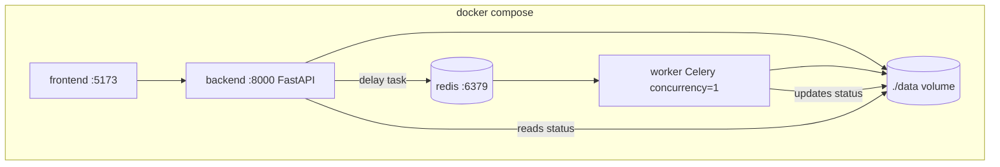
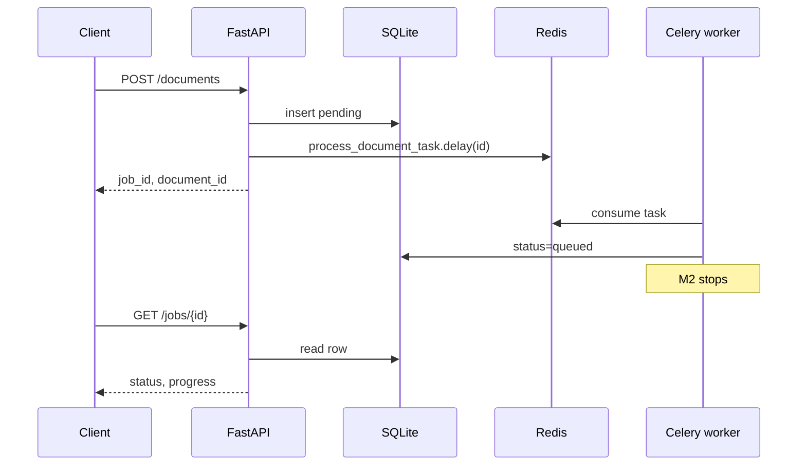
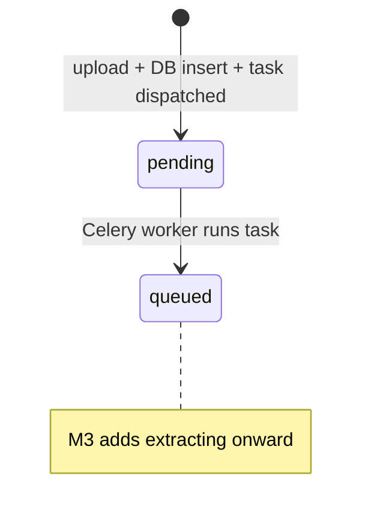

# feat: Upload, validation, SQLite, and job API (Celery + Redis)

## Summary

Implement the backend persistence and API layer for PDF uploads: validate files, store on disk, record jobs in SQLite, expose the four REST endpoints, and dispatch processing via **Celery + Redis** with a dedicated worker container (`--concurrency=1`). M2 task skeleton advances jobs to `queued` only — vision extraction deferred to Milestone 3.

**Architecture change from origin:** Requirements doc specified an in-process asyncio queue; this plan uses Celery + Redis for durable task dispatch, cleaner API/worker separation, and built-in retry hooks for M3.

---

## Problem Frame

The scaffold proves Docker and connectivity work, but there is no upload path, no database, and no job runner. Milestone 2 delivers the data model, API contract, and async execution plumbing the frontend and vision pipeline will build on (see origin: `docs/solutions/architecture-patterns/pdf-summary-ai-requirements-2026-05-24.md`, step 2).

---

## Requirements

- R1. `POST /api/documents` accepts a single PDF multipart upload and returns `{ job_id, document_id }`.
- R2. Server validates PDF magic bytes, size ≤ 50 MB, page count ≤ 100, non-empty file (see origin §9, §11).
- R3. PDFs stored as `data/uploads/{uuid}.pdf`; display name sanitized in DB (see origin §11).
- R4. SQLite persists document/job metadata per origin schema (§2); summary-only after completion — null in M2.
- R5. `GET /api/jobs/{job_id}` returns status, stage, progress, and optional error (see origin §12).
- R6. `GET /api/documents` returns last 5 **completed** documents with summary preview (empty list in M2).
- R7. `GET /api/documents/{id}` returns full metadata; 200 for any known ID including non-completed.
- R8. **Single Celery worker** with `--concurrency=1`: one PDF processed at a time; second upload waits in Redis queue (see origin §3, §18 intent).
- R9. M2 Celery task stops at `queued` — no vision/summary processing (Milestone 3).
- R10. Upload failure rolls back orphan files if DB insert fails.
- R11. **Redis** as Celery broker; worker runs as separate Compose service sharing backend image + `./data` volume.
- R12. **DB is source of truth** for job status/progress — frontend polls SQLite-backed API, not Celery result backend.

**Origin flows:** F1 Upload PDF, F2 Poll job status, F3 View history, F4 View document detail, F5 Concurrent upload queueing

---

## Scope Boundaries

- PyMuPDF rasterization and OpenAI vision/summary calls
- Frontend upload UI, polling, history panel
- Automated tests, CI, `/health`, delete/retry endpoints
- Celery Beat / scheduled tasks
- Flower monitoring UI
- Transitioning jobs to `extracting` / `summarizing` / `completed` / `failed` in M2 (except manual seed)

### Deferred to Follow-Up Work

- **Milestone 3 — Vision pipeline:** implement `process_document` body inside Celery task
- **Milestone 5 — Frontend:** upload/polling/history UI
- **Requirements doc update:** note Celery + Redis as implementation choice (origin still says asyncio queue)

---

## Context & Research

### Relevant Code and Patterns

- `backend/app/main.py` — FastAPI app, CORS, `on_event` startup (migrate DB init to lifespan)
- `backend/app/config.py` — extend with `redis_url`
- `docker-compose.yml` — currently `backend` + `frontend` only; add `redis` + `worker`

### Institutional Learnings

- Origin §2–12: schema, validation, API shape, single-worker intent
- Origin §14 Docker: split services with hot reload — worker reuses backend Dockerfile

### External References

- Celery docs: worker `--concurrency=1`, `--prefetch-multiplier=1` for fair single-job processing
- Redis 7 Alpine image for Compose

---

## Key Technical Decisions

- **`job_id` === `document_id`:** Single `documents` table; same UUID in both response fields.
- **Task queue:** Celery 5.x + Redis broker (`redis://redis:6379/0`).
- **No Celery result backend for status:** Poll `GET /api/jobs/{id}` reads SQLite. Avoids dual state. Optionally set `task_ignore_result=True`.
- **Worker process:** Separate Compose service, same `backend/Dockerfile`, command:
  `celery -A app.celery_app worker --loglevel=info --concurrency=1`
- **Prefetch:** `--prefetch-multiplier=1` so worker doesn't hoard tasks.
- **Dispatch:** Upload handler calls `process_document_task.delay(document_id)` after DB insert.
- **M2 task behavior:** Load row → `status=queued` → return. No OpenAI/PyMuPDF raster in M2.
- **Recovery:** API startup lifespan scans non-terminal DB rows → re-dispatch `.delay()` for each (idempotent: task checks current status before work).
- **Retries (M3):** Batch/summary retries stay **inside** the task (origin §10 backoff), not Celery autoretry — keeps error messages page-specific.
- **ORM:** SQLAlchemy 2.0 sync; worker and API share `./data` volume for SQLite + uploads.
- **Validation order / rollback / filename rules:** unchanged from prior plan draft.

---

## Open Questions

### Resolved During Planning

- Queue tech → Celery + Redis (user decision)
- Job status source → SQLite only, not Celery results
- Single-worker guarantee → Celery `--concurrency=1` + prefetch 1
- Worker location → separate Compose service, not in-process

### Deferred to Implementation

- Store `celery_task_id` on document row (optional, for debugging) — skip in M2 unless useful
- Redis persistence: use default volume or ephemeral (acceptable for take-home; tasks re-dispatched from DB on loss)

---

## High-Level Technical Design

> *Directional guidance for review, not implementation specification.*





**Status machine (M2 subset):**



---

## Output Structure

```
backend/
  app/
    celery_app.py          # Celery instance + config
    tasks/
      __init__.py
      document.py          # process_document_task
    workers/               # deprecated path — use tasks/ instead
docker-compose.yml         # + redis, worker services
.env.example               # + REDIS_URL
```

---

## Implementation Units

- U1. **Database layer and Document model**

**Goal:** Persist document/job rows in SQLite with schema matching origin §2.

**Requirements:** R4

**Dependencies:** None

**Files:**
- Create: `backend/app/db.py`
- Create: `backend/app/models/document.py`
- Modify: `backend/app/models/__init__.py`
- Modify: `backend/requirements.txt` (add `sqlalchemy>=2.0`)
- Modify: `backend/app/main.py` (init DB on startup via lifespan)

**Approach:** Unchanged from prior draft — SQLAlchemy sync, `{DATA_DIR}/db.sqlite`, `Document` model with all origin fields.

**Verification:** `data/db.sqlite` + `documents` table after startup.

---

- U2. **PDF validation and file storage services**

**Goal:** Reusable validation and secure file persistence.

**Requirements:** R2, R3, R10

**Dependencies:** U1

**Files:**
- Create: `backend/app/services/pdf_validation.py`
- Create: `backend/app/services/storage.py`

**Approach:** Unchanged — 50MB, magic bytes, PyMuPDF page count ≤100, temp→rename, sanitize filename.

**Verification:** Valid PDF saved; invalid inputs rejected before DB insert.

---

- U3. **Celery app, Redis, and Compose services**

**Goal:** Runnable Redis broker + Celery worker container; API can dispatch tasks.

**Requirements:** R8, R11, R12

**Dependencies:** U1

**Files:**
- Create: `backend/app/celery_app.py`
- Create: `backend/app/tasks/__init__.py`
- Create: `backend/app/tasks/document.py` (stub task)
- Modify: `backend/requirements.txt` (add `celery[redis]>=5.4`)
- Modify: `backend/app/config.py` (add `redis_url`)
- Modify: `.env.example` (add `REDIS_URL=redis://redis:6379/0`)
- Modify: `docker-compose.yml`

**Approach:**
- `celery_app.py`: `Celery("pdf_summary", broker=settings.redis_url)`; include `app.tasks.document`
- Task config: `task_ignore_result=True`, `worker_prefetch_multiplier=1` (in Celery config or CLI)
- **Compose services:**
  - `redis`: `redis:7-alpine`, port 6379 internal
  - `worker`: build `./backend`, command celery worker, volumes same as backend (`./backend/app`, `./data`), `depends_on: [redis, backend]`, env `REDIS_URL`, `DATA_DIR`
  - `backend`: add `depends_on: [redis]`, `REDIS_URL` env
- M2 stub task:
  ```python
  @shared_task(name="process_document")
  def process_document_task(document_id: str) -> None:
      # load doc, skip if completed/failed
      # set status=queued, commit
  ```

**Patterns to follow:**
- Same backend image for API + worker (DRY Dockerfile)

**Verification:**
- `docker compose up` shows 4 services: backend, frontend, redis, worker
- Worker logs show "ready" and registered `process_document` task

---

- U4. **POST /api/documents upload endpoint**

**Goal:** Accept upload, persist record, dispatch Celery task, return IDs.

**Requirements:** R1, R2, R3, R8, R10

**Dependencies:** U1, U2, U3

**Files:**
- Create: `backend/app/routers/documents.py`
- Create: `backend/app/schemas/document.py`
- Modify: `backend/app/main.py` (router + recovery dispatch in lifespan)

**Approach:**
- `POST /api/documents` — field `file`
- Flow: validate → save → DB `pending` → `process_document_task.delay(str(id))` → return IDs
- Rollback file on DB/dispatch failure
- **Lifespan recovery:** on API start, query non-terminal documents → `.delay()` each (handles Redis flush / worker crash)
- Remove any in-process asyncio worker concept

**Test scenarios:**
- Happy path: upload → task dispatched → poll until `queued`
- Integration: two rapid uploads → second stays `pending` until first task completes (FIFO via Redis)
- Error path: Celery/Redis down at dispatch → 500 + rollback

**Verification:**
- curl upload works; worker log shows task received; job status becomes `queued`

---

- U5. **Job and document read endpoints**

**Goal:** Complete read side of the four-endpoint API.

**Requirements:** R5, R6, R7

**Dependencies:** U1, U4

**Files:**
- Modify: `backend/app/routers/documents.py`
- Modify: `backend/app/schemas/document.py`

**Approach:** Unchanged — GET jobs/documents/list/detail; `stage` derived from `status`; progress from DB columns.

**Verification:** OpenAPI lists all four endpoints; curl poll returns progress object.

---

- U6. **API wiring, README, and Compose docs**

**Goal:** Document new services and endpoints.

**Requirements:** R5, R11

**Dependencies:** U4, U5

**Files:**
- Modify: `backend/app/main.py`
- Modify: `README.md`
- Modify: `docker-compose.yml` (comments if helpful)

**Approach:**
- README: 4-service table (backend, worker, redis, frontend), `REDIS_URL`, curl upload/poll examples
- Note M2: jobs reach `queued` only
- Note architecture deviation from origin asyncio queue

**Verification:** Fresh clone + `docker compose up --build` documented path works.

---

## System-Wide Impact

- **Interaction graph:** API → Redis → Celery worker → SQLite; API reads SQLite only for polls
- **Error propagation:** Dispatch failure → HTTP 500 + file rollback; task exception → log + M3 marks `failed` in DB
- **State lifecycle risks:** Redis ephemeral OK — DB recovery re-dispatches; SQLite shared volume required for worker/API coherency
- **Compose complexity:** 4 services instead of 2 — evaluators need `docker compose up` for full stack
- **Unchanged invariants:** Frontend unchanged in M2; four REST endpoints; CORS; no Celery in browser

---

## Risks & Dependencies

| Risk | Mitigation |
|------|------------|
| SQLite locking (API + worker writes) | Short transactions; single writer worker; WAL mode optional |
| Redis not running → upload fails | `depends_on`; clear error if dispatch fails |
| Task lost if Redis flushed before worker picks up | API startup recovery re-dispatches from DB |
| Heavier Docker footprint | Redis Alpine is small; document in README |
| Origin doc says asyncio queue | Plan records intentional Celery choice; update requirements doc later |

---

## Documentation / Operational Notes

- README must list: `backend`, `worker`, `redis`, `frontend` and ports
- Env: `REDIS_URL=redis://redis:6379/0` (in Docker), `redis://localhost:6379/0` for local non-Docker dev
- M3 implements pipeline inside `process_document_task` — same task name, no API changes
- Optional local debug: `celery -A app.celery_app worker --concurrency=1` without Docker

---

## Sources & References

- **Origin document:** [docs/solutions/architecture-patterns/pdf-summary-ai-requirements-2026-05-24.md](../solutions/architecture-patterns/pdf-summary-ai-requirements-2026-05-24.md)
- **Prior plan:** [docs/plans/2026-05-24-001-feat-initial-project-scaffold-plan.md](2026-05-24-001-feat-initial-project-scaffold-plan.md)
- Celery: worker concurrency and prefetch settings
- Existing: `docker-compose.yml`, `backend/app/config.py`
