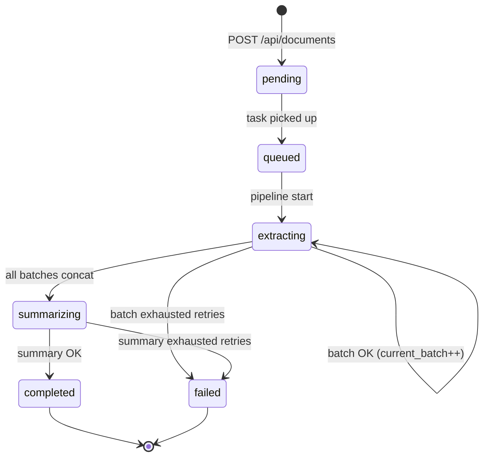

# feat: Vision extraction and summary pipeline (Milestone 3)

## Summary

Extend the Celery `process_document` task from M2’s `queued` stub into the full processing pipeline: PyMuPDF rasterization (150 DPI JPEG), batched `gpt-4o-mini` vision extraction (3 pages per call), in-memory concatenation, a single summary call, and terminal `completed` / `failed` states with progress persisted in SQLite. Retries and error messages follow origin §10; no map-reduce, no extraction persistence, no frontend changes.

---

## Problem Frame

M2 delivers upload, validation, APIs, and a Celery worker that only marks jobs `queued`. Users cannot get summaries until the worker runs vision extraction and summarization (see origin implementation order step 3–4).

---

## Requirements

- R1. Worker runs full pipeline: `pending`/`queued` → `extracting` → `summarizing` → `completed` with `summary` and `completed_at` set (see origin §2, §3, §8).
- R2. Rasterize each page via PyMuPDF at **150 DPI**, **JPEG 85%** (see origin §5).
- R3. Vision extraction: **3 pages per API call**, pages separated with `---` in prompt; model `gpt-4o-mini`, temperature **0**, max tokens **4096** per batch (see origin §5–6).
- R4. Concatenate all batch markdown in memory; **do not** store extraction in DB (see origin §2, §17).
- R5. Single text-only summary call: TL;DR + 5–10 bullets, temperature **0**, max tokens **1024**, auto-detect language (see origin §6–8).
- R6. Update `current_batch` / `total_batches` during extraction; API progress unchanged (see origin §12, M2 `GET /api/jobs`).
- R7. Extraction batch failure: retry up to **3×** with backoff **2s, 4s, 8s**; then `failed` with message like `"Failed on pages 31–33: {error}"` and `failed_at_page` = batch start page (see origin §10).
- R8. Summary failure: retry **2×** (same backoff pattern acceptable), then `failed`; `failed_at_page` null (see origin §10).
- R9. No partial/skip-on-fail batches (see origin §10).
- R10. Prompts **inline** in `backend/app/services/openai.py` (see origin §6, Q21).
- R11. `OPENAI_API_KEY` required for processing; clear failure when missing (see origin §14).
- R12. Recovery: non-terminal jobs re-dispatched on API startup (existing); worker must not no-op on `queued`/`extracting`/`summarizing` (M3 fix).
- R13. No new API endpoints, no automated tests, no frontend (see origin §12, §16, M2/M5 deferrals).

**Origin flows:** F1 Upload PDF, F2 Poll job status, F4 View document detail (summary populated after M3)

---

## Scope Boundaries

- Frontend upload, polling UI, history panel (Milestone 5)
- Map-reduce / chunked summarization for long extractions
- Storing full extraction text or “view extraction” UI
- Celery autoretry for batch/summary (retries stay inside task — M2 decision)
- Manual job retry endpoint, `/health`, automated tests
- Requirements doc rewrite (Celery vs asyncio) — optional note in README only

### Deferred to Follow-Up Work

- **Milestone 5 — Frontend:** staged progress UI wired to job API
- **Requirements doc update:** document Celery + Redis as implemented queue (origin §3 still says asyncio)
- **tiktoken dependency:** only add if pre-summary estimate needs it; char heuristic acceptable for take-home

---

## Context & Research

### Relevant Code and Patterns

- `backend/app/tasks/document.py` — M2 stub; **must remove `QUEUED`/`EXTRACTING`/`SUMMARIZING` early-return** so M3 and recovery work
- `backend/app/services/openai.py` — placeholder; all prompts and API calls here
- `backend/app/services/pdf_validation.py` — existing PyMuPDF (`fitz`) usage for page count
- `backend/app/routers/documents.py` — sets `total_batches = ceil(pages/3)`, `_progress_for` uses `current_batch * 3`
- `backend/app/main.py` — `recover_stuck_jobs()` re-dispatches `NON_TERMINAL_STATUSES`
- `backend/app/celery_app.py` — `worker_process_init` for DB; extend with worker recovery
- `backend/app/models/document.py` — status enum, `failed_at_page`, progress fields
- M2 plan: `docs/plans/2026-05-24-002-feat-upload-validation-sqlite-plan.md` — Celery, SQLite as source of truth

### Institutional Learnings

- Origin §4–10: vision strategy, batch size, retries, failure messages, context-window risk
- Origin §16: no automated tests — manual verification via upload + poll + `GET /api/documents/{id}`
- M2 SessionLocal pattern: `import app.db as db_module` in Celery tasks (fork-safe)

### External References

- OpenAI Chat Completions with vision (multi `image_url` content parts, base64 data URLs)
- PyMuPDF `Page.get_pixmap(dpi=150)` and JPEG export

---

## Key Technical Decisions

- **Task entry guard:** Only skip when status is `completed` or `failed`. All other statuses run the pipeline from batch 1 (reset `current_batch=0`, clear `error_message` on (re)start). Fixes M2 recovery deadlock (see flow analysis).
- **No extraction checkpoint:** Crash mid-run restarts all vision batches; accept duplicate API cost. Progress may reset on restart.
- **Progress commits:** Increment `current_batch` only after a successful batch; commit SQLite after each batch so polling reflects real progress.
- **Retry policy:** In-task retries with 2s/4s/8s backoff. Retry only transient OpenAI errors (429, 5xx, timeout, connection). Fail fast on 401/403/400. Empty batch response after retries → batch failure.
- **Truncation:** If vision response `finish_reason=length`, retry batch once; if still truncated, fail with page-range message (dense PDF safeguard).
- **Context overflow:** Before summary call, estimate input size (e.g. `len(text) // 4` or tiktoken); if above ~100k tokens, fail with user-facing message per origin §4 risk — do not call summary.
- **Missing API key:** At task start, if `settings.openai_api_key` empty → `failed` with `"OPENAI_API_KEY is not configured"`.
- **Top-level try/except:** Any uncaught exception in pipeline → `failed` + logged traceback; never leave zombie `extracting`/`summarizing`.
- **Worker recovery:** Call same `recover_stuck_jobs()` from `worker_process_init` so worker-only restarts re-queue jobs (not only API lifespan).
- **OpenAI SDK:** Add `openai` to `requirements.txt`; sync client with per-call timeout (~120s) acceptable for take-home.
- **New module:** `backend/app/services/pdf_rasterize.py` — page iteration and JPEG bytes; keeps task orchestration thin.
- **Dependencies:** `PAGES_PER_BATCH = 3`, `DPI = 150`, `JPEG_QUALITY = 85` as module constants aligned with origin.

---

## Open Questions

### Resolved During Planning

- Resume mid-extraction? → Restart from batch 1; no DB checkpoint (by design).
- M2 `queued` guard? → Remove from skip list; `queued` is transient into `extracting`.
- Duplicate Celery tasks? → Single worker + concurrency 1; optional idempotent “reset and run” on re-entry is sufficient.

### Deferred to Implementation

- Exact OpenAI message JSON shape for multi-image user content
- Whether to add `tiktoken` or char heuristic only for pre-summary guard
- Optimal client timeout value after first real PDF timing

---

## High-Level Technical Design

> *This illustrates the intended approach and is directional guidance for review, not implementation specification. The implementing agent should treat it as context, not code to reproduce.*



```mermaid
sequenceDiagram
    participant T as Celery task
    participant R as pdf_rasterize
    participant O as openai service
    participant DB as SQLite

    T->>DB: status=extracting, reset progress
    loop each batch 1..N
        T->>R: rasterize pages for batch
        T->>O: extract_batch(images) with retries
        O-->>T: markdown chunk
        T->>DB: current_batch++, commit
    end
    T->>DB: status=summarizing
    T->>O: summarize(concat) with retries
    O-->>T: TL;DR + bullets
    T->>DB: summary, completed_at, status=completed
```

---

## Implementation Units

- U1. **PDF rasterization service**

**Goal:** Produce JPEG byte buffers for page ranges used by vision batches.

**Requirements:** R2, R3

**Dependencies:** None

**Files:**
- Create: `backend/app/services/pdf_rasterize.py`

**Approach:**
- Open PDF from `file_path` with `fitz`.
- For batch index `b` (1-based): pages `(b-1)*3` .. `min(b*3, total_pages)-1` in 0-based indexing.
- `get_pixmap(dpi=150)` → JPEG bytes at quality 85.
- Close document in context manager; propagate raster errors to caller for batch failure handling.

**Patterns to follow:**
- `backend/app/services/pdf_validation.py` — `fitz.open` usage

**Test scenarios:**
- Test expectation: none — origin §16; manual verify with multi-page PDF in M3 integration

**Verification:**
- Service returns one JPEG buffer per page in batch; last batch of 100-page doc returns 1 image

---

- U2. **OpenAI service — prompts, extraction, summary**

**Goal:** Encapsulate inline prompts, vision batch calls, summary call, retries, and error classification.

**Requirements:** R3, R5, R7, R8, R10, R11

**Dependencies:** U1 (images fed from task; service accepts bytes/list)

**Files:**
- Modify: `backend/app/services/openai.py`
- Modify: `backend/requirements.txt` (add `openai`)

**Approach:**
- Module-level prompt strings (extraction system/user template with page numbers; summary system/user).
- `extract_batch(page_images, start_page, end_page) -> str` — build multi-part user message with base64 `image_url` entries; call `gpt-4o-mini`; return markdown text.
- `summarize(full_text) -> str` — text-only completion; return formatted TL;DR + bullets.
- Shared `_call_with_retries(fn, max_attempts, backoff_seconds)` — 3 attempts for extraction, 2 for summary; classify errors.
- `check_context_limit(text) -> None | error_message` before summary.
- Fail fast if API key missing when client is first used.

**Patterns to follow:**
- Origin §6 prompt intent (Markdown tables, captions, primary language)

**Test scenarios:**
- Test expectation: none — origin §16; manual test with real `OPENAI_API_KEY` and small PDF

**Verification:**
- Extraction returns non-empty markdown for a 1–3 page sample PDF
- Summary returns string starting with `TL;DR` (or localized equivalent) for concatenated sample text

---

- U3. **Celery pipeline orchestration**

**Goal:** Wire rasterization + OpenAI into `process_document_task` with correct status transitions and progress.

**Requirements:** R1, R4, R6, R7, R8, R9, R12

**Dependencies:** U1, U2

**Files:**
- Modify: `backend/app/tasks/document.py`

**Approach:**
- Replace M2 body: skip only `completed`/`failed`.
- On entry: validate API key; load doc; verify `file_path` exists; set `extracting`, `current_batch=0`, clear `error_message`/`failed_at_page`; `total_batches` already set at upload.
- Loop `batch_num` 1..`total_batches`: rasterize → `extract_batch` with retries → append to in-memory list → increment `current_batch`, commit.
- Set `summarizing`, commit; concat chunks with newlines; run context check → `summarize` with retries.
- On success: set `summary`, `completed_at`, `status=completed`.
- On batch failure: `failed`, `error_message` with page range, `failed_at_page=start_page`.
- On summary failure: `failed`, message `"Summary generation failed: ..."`, `failed_at_page` null.
- Wrap entire body in try/except → generic `failed` for unexpected errors.

**Patterns to follow:**
- `import app.db as db_module` + `db_module.SessionLocal()` (M2 fork fix)
- M2 plan: retries inside task, not Celery autoretry

**Test scenarios:**
- Test expectation: none — origin §16

**Verification:**
- Upload PDF → poll until `completed` → `GET /api/documents/{id}` returns non-null `summary`
- Progress shows `current_batch` increasing during `extracting`
- Simulated bad key → `failed` with clear message

---

- U4. **Worker recovery and configuration**

**Goal:** Re-queue stuck jobs when worker starts; document API key requirement.

**Requirements:** R11, R12

**Dependencies:** U3

**Files:**
- Modify: `backend/app/celery_app.py`
- Modify: `.env.example`
- Modify: `docker-compose.yml` (ensure `OPENAI_API_KEY` passed to `worker` service if not already)

**Approach:**
- Import and call `recover_stuck_jobs()` from `worker_process_init` after `init_db` (avoid circular import — import inside signal handler).
- Update `.env.example` comment: key required for M3 processing.
- Confirm worker service env mirrors backend for `OPENAI_API_KEY`, `DATA_DIR`, `REDIS_URL`.

**Patterns to follow:**
- `backend/app/main.py` — `recover_stuck_jobs`

**Test scenarios:**
- Test expectation: none — manual: stop worker mid-job, restart worker, job eventually completes or restarts from batch 1

**Verification:**
- Worker restart with job in `extracting` leads to re-processing (not permanent stall)

---

- U5. **README and manual verification notes**

**Goal:** Document M3 behavior, limitations, and demo steps for evaluators.

**Requirements:** R13 (documentation alignment with origin README expectations)

**Dependencies:** U3, U4

**Files:**
- Modify: `README.md`

**Approach:**
- Note vision pipeline is active; `OPENAI_API_KEY` required for end-to-end.
- Document status values and example poll progression.
- Limitations: 100 pages, context overflow error, single worker, restart re-runs extraction.

**Test scenarios:**
- Test expectation: none — documentation only

**Verification:**
- README instructions sufficient to run upload → completed summary via Docker Compose

---

## System-Wide Impact

- **Interaction graph:** Only `process_document_task` and `openai`/`pdf_rasterize` services change behavior; HTTP routers unchanged except consumers see real `summary` and terminal statuses.
- **Error propagation:** All failures terminal at `failed` in SQLite; API exposes `error_message` on job poll.
- **State lifecycle risks:** Re-dispatch + no checkpoint may double OpenAI spend; progress reset on restart.
- **API surface parity:** No new endpoints; response shapes unchanged.
- **Integration coverage:** Manual E2E: upload → worker → poll → document detail; second upload while first runs shows queue behavior (unchanged from M2).
- **Unchanged invariants:** Upload validation, four endpoints, history still last 5 completed only, Celery `task_ignore_result=True`, SQLite as job source of truth.

---

## Risks & Dependencies

| Risk | Mitigation |
|------|------------|
| Context window exceeded on dense 100-page PDF | Pre-summary token estimate; fail with clear message |
| Vision `max_tokens=4096` truncates dense batch | Retry once on `finish_reason=length`; then fail with page range |
| OpenAI rate limits / cost | Single worker; backoff retries; assignment scope accepts latency |
| M2 task guard leaves jobs stuck | U3 entry guard fix |
| Worker crash loses in-memory extraction | Document restart behavior in README; recovery re-dispatches |
| Missing API key on worker only | Env parity in Compose; fail at task start |

---

## Documentation / Operational Notes

- Set `OPENAI_API_KEY` in `.env` before `docker compose up` for M3 demos.
- Worker and backend must share `./data` volume (already in M2 Compose).
- Loom script (origin): upload → extracting progress → summarizing → completed summary.

---

## Sources & References

- **Origin document:** [docs/solutions/architecture-patterns/pdf-summary-ai-requirements-2026-05-24.md](../solutions/architecture-patterns/pdf-summary-ai-requirements-2026-05-24.md)
- Prior plan: [docs/plans/2026-05-24-002-feat-upload-validation-sqlite-plan.md](2026-05-24-002-feat-upload-validation-sqlite-plan.md)
- Related code: `backend/app/tasks/document.py`, `backend/app/services/openai.py`
- OpenAI: https://platform.openai.com/docs/guides/vision
