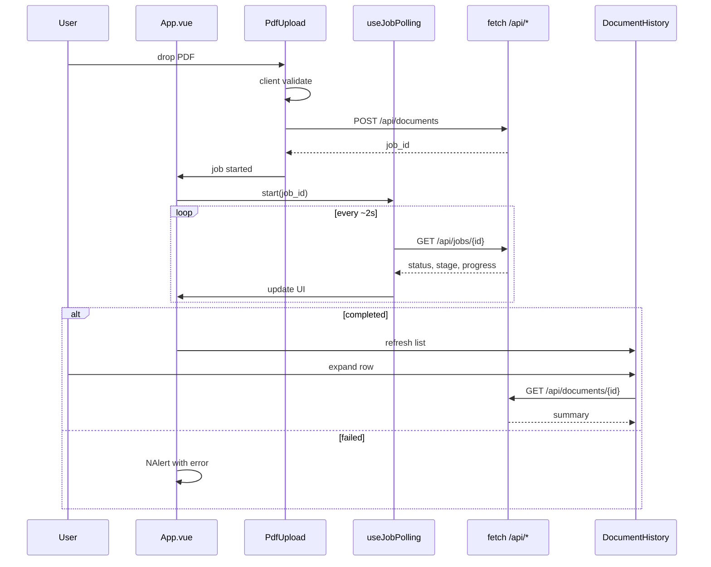

# feat: Frontend upload, polling, and history (Milestone 5)

## Summary

Replace the Vue scaffold with a working single-page UI: PDF upload with client validation, ~2s job polling with staged progress (`NUpload`, `NProgress`, `NAlert`, `NSpin`), and a history panel listing the last five completed documents with inline summary expand (`NCollapse`). Wire everything to the existing four REST endpoints via a thin typed `fetch` layer — no new backend work, no Pinia/router/tests.

---

## Problem Frame

M3 completes the backend pipeline, but the UI is still a disabled upload placeholder. Users cannot demo the product through the browser without curl (see origin §9, §13, Loom script).

---

## Requirements

- R1. Enable single-file PDF upload via drag-and-drop and file picker (see origin §9).
- R2. Client validation: PDF MIME/type, size ≤ 50 MB; surface server errors (including page count > 100) from POST response (see origin §9).
- R3. On successful upload, poll `GET /api/jobs/{job_id}` every ~2 seconds until `completed` or `failed` (see origin §3, F2).
- R4. Staged progress UI — not a generic spinner only: show `stage` and batch progress during `extracting`, summarizing state, done/failed (see origin §9, §12).
- R5. On `failed`, show error in active upload area; failed jobs do not appear in history (see origin §2, §10).
- R6. History panel: last 5 **completed** documents via `GET /api/documents` — filename, date, status badge (see origin §2, §13, F3).
- R7. Click history row → inline expand full summary via `GET /api/documents/{id}` (see origin §13).
- R8. Use Naive UI components per origin: `NUpload`, `NProgress`, `NCollapse`, `NAlert`, `NSpin` (see origin §13).
- R9. Refresh history after upload completes successfully (see origin F3).
- R10. Use `VITE_API_URL` for API base; no new env vars (see origin §14).
- R11. No automated frontend tests (see origin §16).
- R12. Remove scaffold milestone alert and disabled-upload placeholder when real UI works.

**Origin flows:** F1 Upload PDF, F2 Poll job status, F3 View history, F4 View document detail

---

## Scope Boundaries

- Backend API changes, new endpoints, auth, rate limiting
- Automated tests (unit, E2E, Vitest)
- Vue Router, Pinia, axios
- Markdown renderer for summaries (plain text with `white-space: pre-wrap` is sufficient)
- Multi-file upload queue UI (origin out-of-scope)
- Mobile-responsive polish (nice-to-have only)
- Full Loom recording production (manual, post-implementation)

### Deferred to Follow-Up Work

- **Milestone 6 — Submission polish:** expand README for evaluators, record Loom demo per origin script
- **Requirements doc update:** Celery + Redis note (unchanged from M2 deferral)
- **BackendStatus refactor:** optional; only if trivial while touching `App.vue`

---

## Context & Research

### Relevant Code and Patterns

- `frontend/src/App.vue` — layout shell, disabled `NUpload`, scaffold alert to remove
- `frontend/src/components/BackendStatus.vue` — only existing `fetch` pattern; `import.meta.env.VITE_API_URL`
- `frontend/src/main.ts` — global `naive-ui` plugin
- `backend/app/schemas/document.py` — response shapes to mirror in TS types
- `backend/app/routers/documents.py` — upload field name `file`, job progress calculation
- M3 plan: backend complete; no API gapsCard needed for M5

### Institutional Learnings

- Origin §9: client + server validation, staged progress
- Origin §13: minimal history, inline expand, Naive component list
- Origin §16: manual verification only
- Repo Vue skill: `<script setup lang="ts">`, Composition API, composables for reusable logic

### External References

- [Naive UI Upload](https://www.naiveui.com/en-US/os-theme/components/upload) — custom request for controlled upload flow
- [Naive UI Collapse](https://www.naiveui.com/en-US/os-theme/components/collapse) — inline expand pattern

---

## Key Technical Decisions

- **No Pinia/router:** Single-page app with two data domains (active job + history); composables + `App.vue` orchestration is enough.
- **Native `fetch` only:** Matches existing `BackendStatus.vue`; typed wrapper in `api/client.ts`.
- **Custom upload handler:** Use `NUpload` with `:custom-request` (or equivalent controlled flow) so upload state ties to job polling, not Naive's default XHR behavior.
- **Polling composable:** `useJobPolling(jobId)` — `setInterval` ~2000ms, clear on terminal status and `onUnmounted`; expose `status`, `stage`, `progress`, `error`, `isPolling`.
- **Progress percent:** During `extracting`, `(current_batch / total_batches) * 100` when `total_batches > 0`; indeterminate or high fixed percent during `summarizing`; hide or 100% on `completed`.
- **Stage display:** Prefer API `stage` string over re-mapping `status` locally.
- **History expand:** Fetch full document on expand (lazy); cache in composable map by id to avoid refetch on re-collapse.
- **Summary rendering:** `pre-wrap` text block — backend returns plain TL;DR + bullets with `•`.
- **Constants:** `MAX_FILE_SIZE_BYTES = 50 * 1024 * 1024`, PDF magic `%PDF` check on first bytes optional alongside MIME.
- **Concurrent uploads:** Each upload starts its own poll loop for its `job_id`; UI shows the most recent active job prominently (second upload while first runs shows queued/extracting per its own poll — satisfies Loom queue demo).

---

## Open Questions

### Resolved During Planning

- Need backend changes? → No; all four endpoints ready.
- Pinia for history? → No; composable sufficient.
- Show in-progress upload in history? → No; completed only per origin.

### Deferred to Implementation

- Exact `NUpload` API choice (`custom-request` vs `@change` + manual fetch) — pick whichever gives cleanest error/state handling in Naive 2.40
- Whether to auto-expand newly completed summary in history or only refresh list

---

## High-Level Technical Design

> *This illustrates the intended approach and is directional guidance for review, not implementation specification. The implementing agent should treat it as context, not code to reproduce.*

---

## Output Structure

    frontend/src/
    ├── api/
    │   ├── client.ts
    │   └── documents.ts
    ├── types/
    │   └── api.ts
    ├── composables/
    │   ├── useJobPolling.ts
    │   └── useDocumentHistory.ts
    ├── components/
    │   ├── BackendStatus.vue      (unchanged or minor)
    │   ├── PdfUpload.vue
    │   ├── JobProgress.vue
    │   └── DocumentHistory.vue
    ├── App.vue
    └── main.ts

---

## Implementation Units

- U1. **API client and TypeScript types**

**Goal:** Typed access to all four backend endpoints with consistent base URL and error parsing.

**Requirements:** R10

**Dependencies:** None

**Files:**
- Create: `frontend/src/types/api.ts`
- Create: `frontend/src/api/client.ts`
- Create: `frontend/src/api/documents.ts`

**Approach:**
- Mirror Pydantic models: `UploadResponse`, `JobResponse`, `Progress`, `DocumentListResponse`, `DocumentDetailResponse`, `DocumentSummaryItem`.
- `getBaseUrl()` from `import.meta.env.VITE_API_URL` with localhost fallback.
- `apiFetch<T>` parses JSON; on non-OK, extract FastAPI `detail` (string or array) into thrown `ApiError`.
- `uploadDocument(file)`, `getJob(id)`, `listDocuments()`, `getDocument(id)` in `documents.ts`.

**Patterns to follow:**
- `frontend/src/components/BackendStatus.vue` — env var usage

**Test scenarios:**
- Test expectation: none — origin §16

**Verification:**
- Types align with OpenAPI at `/docs` response shapes
- Upload helper sends multipart field name `file`

---

- U2. **Job polling composable**

**Goal:** Reusable ~2s poll loop with cleanup for active uploads.

**Requirements:** R3, R4, R5

**Dependencies:** U1

**Files:**
- Create: `frontend/src/composables/useJobPolling.ts`

**Approach:**
- Accept `Ref<string | null>` job id; watch id and start/stop polling.
- Poll `getJob` every 2000ms until `status` is `completed` or `failed`.
- Expose reactive `job`, `isPolling`, `isTerminal`, `isFailed`, `isCompleted`.
- Clear interval on unmount and when job id cleared.

**Patterns to follow:**
- Vue skill: composable with `ref`/`computed`/`watch`/`onUnmounted`

**Test scenarios:**
- Test expectation: none — origin §16

**Verification:**
- Starting poll with valid id updates reactive job state
- Terminal status stops polling without leak (interval cleared)

---

- U3. **Upload component with client validation**

**Goal:** Working drag-and-drop upload that kicks off backend job.

**Requirements:** R1, R2, R12

**Dependencies:** U1, U2

**Files:**
- Create: `frontend/src/components/PdfUpload.vue`
- Create: `frontend/src/constants/limits.ts` (optional; or inline constants in component)

**Approach:**
- `NUpload` + `NUploadDragger`, single file, `accept=".pdf,application/pdf"`.
- Before POST: reject if not PDF type and/or size > 50 MB — show `NAlert` inline.
- On success emit `uploaded` with `jobId`; on failure show server `detail`.
- Disable upload while active job is non-terminal (optional UX — prevents pile-up; still allow if user wants Loom queue demo — **allow concurrent uploads**, show status for latest job in App).

**Patterns to follow:**
- Existing `App.vue` upload card layout

**Test scenarios:**
- Test expectation: none — origin §16; manual: reject 51MB file client-side; reject .txt; accept valid PDF

**Verification:**
- Valid PDF triggers POST and emits job id
- Oversized file blocked before network call

---

- U4. **Job progress component**

**Goal:** Staged progress display during active job.

**Requirements:** R4, R5, R8

**Dependencies:** U2

**Files:**
- Create: `frontend/src/components/JobProgress.vue`

**Approach:**
- Props: job state from polling composable (or individual props: `status`, `stage`, `progress`, `error`).
- `extracting`: show `NProgress` (determinate from batch ratio) + text e.g. "Extracting (batch 4/34)" using `progress.current_batch` / `progress.total_batches`.
- `summarizing`: `NProgress` processing/indeterminate + stage label.
- `pending`/`queued`: `NSpin` + stage.
- `failed`: `NAlert` type error with job error or poll error message.
- `completed`: success alert or brief "Done" before handoff to history.

**Patterns to follow:**
- Origin §12 progress object fields

**Test scenarios:**
- Test expectation: none — origin §16

**Verification:**
- UI reflects each status stage when polling a real job

---

- U5. **Document history with inline expand**

**Goal:** Show last 5 completed documents; expand to full summary.

**Requirements:** R6, R7, R8, R9

**Dependencies:** U1

**Files:**
- Create: `frontend/src/components/DocumentHistory.vue`
- Create: `frontend/src/composables/useDocumentHistory.ts`

**Approach:**
- Composable: `items`, `loading`, `error`, `refresh()`, `expandedId`, `expandedDetail`, `expand(id)` lazy-fetches detail.
- `DocumentHistory.vue`: list rows with filename, formatted `uploaded_at`, `NTag` status; `NCollapse` or click-to-expand panel for full `summary`.
- Call `refresh()` on mount and expose for parent to call after job completes.

**Patterns to follow:**
- Origin §13 minimal rows + inline expand

**Test scenarios:**
- Test expectation: none — origin §16

**Verification:**
- Empty state when no completed docs
- After completed upload, list shows new entry; expand shows full summary text

---

- U6. **App shell integration and scaffold removal**

**Goal:** Wire upload → poll → history into the main page; remove milestone placeholder.

**Requirements:** R3, R9, R12

**Dependencies:** U3, U4, U5

**Files:**
- Modify: `frontend/src/App.vue`

**Approach:**
- Compose `PdfUpload`, `JobProgress`, `DocumentHistory` in vertical layout below header.
- Hold `activeJobId` ref; on upload success set id and start polling.
- Watch `isCompleted` → refresh history; clear or keep progress briefly.
- Remove scaffold `NAlert` and enable upload card.
- Keep `BackendStatus` in header.

**Patterns to follow:**
- Existing `NLayout` structure in `App.vue`

**Test scenarios:**
- Test expectation: none — origin §16; manual E2E per Loom script steps 2–5

**Verification:**
- Full flow in browser: upload PDF → see extracting progress → completed → history expand shows summary
- Failed upload (e.g. no API key on worker) shows error without history entry

---

## System-Wide Impact

- **Interaction graph:** Frontend only; calls existing backend endpoints. CORS already allows `5173`.
- **Error propagation:** POST errors and job `failed` status surface in upload/progress area via `NAlert`.
- **State lifecycle risks:** Poll interval must clear on route unmount (single page — component unmount only); multiple concurrent polls if user uploads twice quickly — acceptable for demo.
- **API surface parity:** No backend changes; TS types must stay in sync with `backend/app/schemas/document.py`.
- **Integration coverage:** Manual browser E2E is the verification gate (origin §16, Loom script).
- **Unchanged invariants:** Backend processing pipeline, four endpoints, history still last 5 completed only.

---

## Risks & Dependencies

| Risk | Mitigation |
|------|------------|
| Naive Upload API awkward for custom flow | Use custom-request pattern; fall back to manual fetch on file select |
| Poll leak on rapid re-upload | Composable clears prior interval when job id changes |
| Large summary text layout | Scrollable expand panel with max-height |
| Page count only validated server-side | Show server 400 message clearly |

---

## Documentation / Operational Notes

- No README overhaul required in M5 beyond removing "M3 complete / frontend deferred" if still present — full submission README/Loom deferred to Milestone 6.
- Demo: `docker compose up`, open `http://localhost:5173`, upload PDF with `OPENAI_API_KEY` set.

---

## Sources & References

- **Origin document:** [docs/solutions/architecture-patterns/pdf-summary-ai-requirements-2026-05-24.md](../solutions/architecture-patterns/pdf-summary-ai-requirements-2026-05-24.md)
- Prior plan: [docs/plans/2026-05-24-003-feat-vision-summary-pipeline-plan.md](2026-05-24-003-feat-vision-summary-pipeline-plan.md)
- Backend schemas: `backend/app/schemas/document.py`
- Frontend shell: `frontend/src/App.vue`
