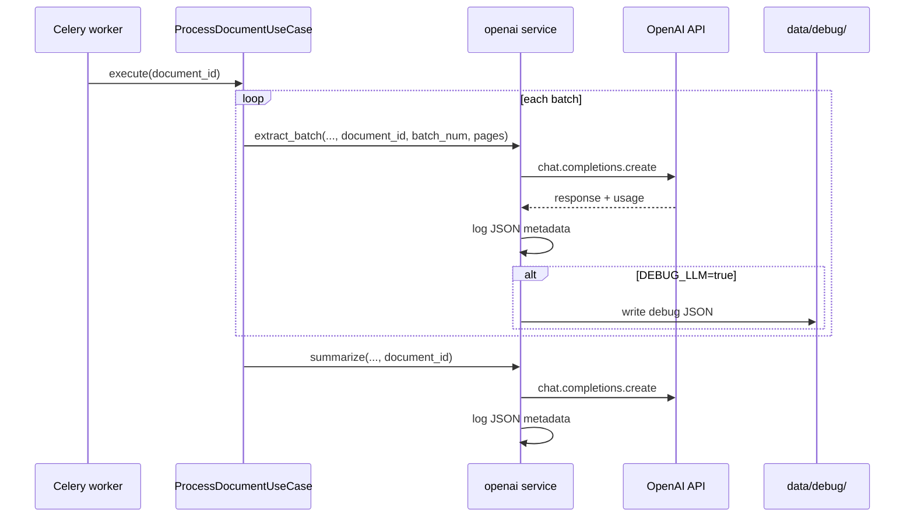

# feat: Minimal LLM observability (structured logs + DEBUG_LLM artifacts)

## Summary

Add production-safe structured logging for every OpenAI call in the Celery worker (correlated by `document_id`, batch, and operation), plus optional on-disk debug artifacts when `DEBUG_LLM=true`. Document OpenAI Usage dashboard for cost/token checks. No new observability SaaS or DB schema changes.

---

## Problem Frame

The vision pipeline runs in a Celery worker with no per-call visibility: only tenacity retry warnings and exception tracebacks appear in logs, and intermediate extraction markdown is never persisted. Operators cannot answer “what was sent, what came back, how long, how many tokens” without ad-hoc code changes. (see `docs/solutions/architecture-patterns/pdf-summary-ai-requirements-2026-05-24.md` § debugging notes)

---

## Requirements

- R1. **Prod metadata logging** — Every `extract_batch` and `summarize` call emits one structured log line on success and one on failure with: `document_id`, `operation` (`extraction` | `summary`), `model`, `start_page`/`end_page` (extraction only), `batch_num` (when known), `latency_ms`, `prompt_tokens`, `completion_tokens`, `total_tokens`, `finish_reason`, `response_chars`, `attempt` (1-based, including retries), and `error_type` on failure. No base64 image data or full markdown in prod logs.
- R2. **Correlation** — `document_id` is present on all LLM log lines for a job.
- R3. **DEBUG_LLM artifacts** — When `DEBUG_LLM=true`, write per-call JSON files under `{data_dir}/debug/{document_id}/` containing prompts (text only; images as placeholders), raw model response text, usage, and timestamps. Disabled by default.
- R4. **Logging bootstrap** — Worker (and API for consistency) use a shared logging configuration: default `INFO`, overridable via `LOG_LEVEL` env.
- R5. **Preserve retry semantics** — Tenacity retry behavior and `before_sleep_log` warnings remain unchanged (see `docs/plans/2026-05-24-007-refactor-tenacity-openai-retries-plan.md` R6).
- R6. **Operational docs** — README documents: `docker compose logs -f worker`, `LOG_LEVEL`, `DEBUG_LLM`, and [OpenAI Usage](https://platform.openai.com/usage) for aggregate cost (not per-document).
- R7. **No new runtime dependencies** — Use stdlib `logging` + `json` only (minimal stack decision from brainstorm).

**Origin actors:** Operator / developer debugging pipeline jobs in Docker.

**Origin flows:** F1 — Document processing (extract batches → summarize).

---

## Scope Boundaries

- Langfuse, LangSmith, Helicone, Sentry, OpenTelemetry, Datadog
- Persisting extraction chunks in SQLite or exposing them via API
- Flower / Celery monitoring UI
- OpenAI Usage API integration (dashboard link only)
- FastAPI request-body logging (upload path is separate from LLM calls)
- Redacting PII beyond image base64 (operators accept DEBUG risk locally)

### Deferred to Follow-Up Work

- `celery_task_id` on document row for queue-level tracing
- Centralized log aggregation (Loki, CloudWatch) — deployment-specific
- Token/cost alerting thresholds

---

## Context & Research

### Relevant Code and Patterns

- `backend/app/services/openai.py` — sole OpenAI call site; tenacity on `_call_extraction` / `_call_summary`
- `backend/app/use_cases/process_document.py` — batch loop; should pass correlation context into service
- `backend/app/config.py` — extend `Settings` (pattern: pydantic env fields)
- `backend/app/celery_app.py` — `worker_process_init` hook for logging init
- `backend/app/main.py` — call same logging init on API startup
- `docker-compose.yml` — worker already `--loglevel=info`; pass new env vars via `.env`
- `backend/tests/test_openai_retries.py` — mock `_get_client`, patch `tenacity.nap.sleep`

### Institutional Learnings

- `docs/solutions/architecture-patterns/fastapi-layered-backend-di-2026-05-24.md` — LLM logic stays in `services/openai.py`
- `docs/plans/2026-05-24-003-feat-vision-summary-pipeline-plan.md` — retries and warning logs in service layer
- `docs/plans/2026-05-24-007-refactor-tenacity-openai-retries-plan.md` — `before_sleep_log` contract

### External References

- [OpenAI Usage dashboard](https://platform.openai.com/usage) — aggregate tokens/cost per API key
- [OpenAI production best practices — monitoring](https://platform.openai.com/docs/guides/production-best-practices) — usage limits, not prompt replay for Chat Completions

---

## Key Technical Decisions

- **Stdlib JSON log lines:** Emit one JSON object per line as the log `message` (e.g. `logger.info(json.dumps({...}))`) so `docker compose logs worker` is grep/jq-friendly without adding `structlog` or `python-json-logger`.
- **Optional correlation kwargs:** Add optional `document_id`, `batch_num`, `start_page`, `end_page` parameters to `extract_batch` / `summarize` rather than `contextvars` — explicit, testable, no hidden global state.
- **Debug artifacts off by default:** `DEBUG_LLM` defaults `False`; files written only under `{data_dir}/debug/` and gitignored via existing `data/` convention.
- **Image redaction:** Prod logs and debug JSON never include base64; debug records `image_count` and page range only.
- **Attempt tracking:** Wrap tenacity-decorated inner calls with a thin loop or custom `before_sleep` that increments attempt counter passed into log payload (or read `retry.statistics` after call) — exact mechanism deferred to implementation; contract is `attempt` in R1 logs.
- **Logging init in one module:** New `backend/app/logging_config.py` with `configure_logging(level: str)` imported from `main` lifespan and `celery_app.worker_process_init`.

---

## Open Questions

### Resolved During Planning

- **Where to instrument?** `openai.py` for call-level; `process_document.py` passes `document_id` / batch metadata.
- **Full prompt in prod?** No — metadata only; full text only in DEBUG artifacts (brainstorm decision).

### Deferred to Implementation

- Exact debug filename pattern (`{timestamp}-{operation}-attempt{n}.json` vs batch-indexed names)
- Whether to log summary input `content_chars` vs hashing for size monitoring

---

## High-Level Technical Design

> *Directional guidance for review, not implementation specification.*

---

## Implementation Units

- U1. **Settings and env documentation**

**Goal:** Expose `LOG_LEVEL` and `DEBUG_LLM` via settings and `.env.example`.

**Requirements:** R3, R4, R6

**Dependencies:** None

**Files:**
- Modify: `backend/app/config.py`
- Modify: `.env.example`
- Modify: `README.md`

**Approach:**
- Add `log_level: str = "INFO"` and `debug_llm: bool = False` to `Settings` (env: `LOG_LEVEL`, `DEBUG_LLM`).
- Document in README env table and a short “Debugging LLM calls” subsection.

**Test scenarios:**
- Test expectation: none — config fields only; behavior covered in U3/U4 tests.

**Verification:**
- Settings load `DEBUG_LLM=true` / `LOG_LEVEL=DEBUG` from env in tests via monkeypatch.

---

- U2. **Shared logging configuration**

**Goal:** Consistent log level/format for API and worker processes.

**Requirements:** R4

**Dependencies:** U1

**Files:**
- Create: `backend/app/logging_config.py`
- Modify: `backend/app/main.py`
- Modify: `backend/app/celery_app.py`

**Approach:**
- `configure_logging(level: str)` sets root logger level and a simple format (`%(asctime)s %(levelname)s %(name)s %(message)s`).
- Call from FastAPI lifespan / startup and `worker_process_init` after DB init.

**Test scenarios:**
- Happy path: after `configure_logging("DEBUG")`, a test logger emits at DEBUG level (caplog or handler level check).

**Verification:**
- Worker and backend both invoke `configure_logging(settings.log_level)` on startup.

---

- U3. **LLM observability helper**

**Goal:** Centralize JSON log emission and debug artifact writes.

**Requirements:** R1, R3, R7

**Dependencies:** U1

**Files:**
- Create: `backend/app/services/llm_observability.py`
- Test: `backend/tests/test_llm_observability.py`

**Approach:**
- Functions such as `log_llm_success(payload: dict)` / `log_llm_failure(payload: dict)` that `json.dumps` with `default=str`.
- `write_debug_artifact(data_dir, document_id, filename, payload)` creates directory tree and writes UTF-8 JSON; no-op when `debug_llm` is False.
- Helper to build “safe” prompt representation for debug (strip `image_url` payloads, keep text parts).

**Patterns to follow:**
- Module-level functions, no classes required (match `pdf_rasterize.py` style).

**Test scenarios:**
- Happy path: `log_llm_success` emits parseable JSON with required keys.
- Edge case: debug writer skips when `debug_llm=False`.
- Happy path: debug writer creates file under `tmp_path` when `debug_llm=True`.
- Edge case: prompt sanitizer replaces image blocks with `{ "type": "image_placeholder", "count": N }`.

**Verification:**
- Unit tests pass without network.

---

- U4. **Instrument OpenAI service**

**Goal:** Wrap each completion with timing, usage extraction, structured logs, and optional debug dumps.

**Requirements:** R1, R3, R5

**Dependencies:** U1, U3

**Files:**
- Modify: `backend/app/services/openai.py`
- Modify: `backend/tests/test_openai_retries.py` (ensure mocks return `usage` on completion objects)

**Approach:**
- Extend `extract_batch` / `summarize` signatures with optional `document_id: str | None = None`, `batch_num: int | None = None` (extraction already has page range).
- In `_call_extraction` / `_call_summary`: record `time.perf_counter()` around `client.chat.completions.create`; on success log metadata from `response.usage` and `choice.finish_reason`; on failure log `error_type` and re-raise.
- On DEBUG, write artifact before return / after failure with sanitized prompt + response text.
- Keep tenacity decorators; ensure failure after exhausting retries still emits failure log once per terminal error (not per retry — retries continue using `before_sleep_log` only).

**Patterns to follow:**
- `backend/app/services/openai.py` existing retry decorators
- Mock pattern in `backend/tests/test_openai_retries.py`

**Test scenarios:**
- Happy path: successful `extract_batch` with `document_id` produces log line containing that id (caplog).
- Happy path: mock completion includes `usage`; log payload includes `prompt_tokens` > 0.
- Error path: non-retryable `OpenAIServiceError` logs once with `error_type`.
- Edge case: `document_id=None` still logs operation and latency (optional fields omitted).
- Integration: existing retry tests still pass (call counts unchanged).

**Verification:**
- `pytest backend/tests/test_openai_retries.py backend/tests/test_llm_observability.py` green.

---

- U5. **Wire correlation from use case**

**Goal:** Pass `document_id` and batch context from pipeline into OpenAI calls.

**Requirements:** R2

**Dependencies:** U4

**Files:**
- Modify: `backend/app/use_cases/process_document.py`
- Test: extend `backend/tests/test_document_use_cases.py` or add focused test with caplog/mock

**Approach:**
- In batch loop: `openai_service.extract_batch(..., document_id=document_id, batch_num=batch_num)`.
- For summarize: `openai_service.summarize(full_text, document_id=document_id)`.

**Patterns to follow:**
- `backend/app/use_cases/process_document.py` existing error mapping

**Test scenarios:**
- Integration: when OpenAI service is mocked, `extract_batch` receives `document_id` matching the document under test (mock assert).

**Verification:**
- Use-case tests pass; manual smoke: upload PDF, `docker compose logs worker | grep document_id`.

---

- U6. **Operational documentation**

**Goal:** Operators know how to debug without reading source.

**Requirements:** R6

**Dependencies:** U1

**Files:**
- Modify: `README.md`

**Approach:**
- Add subsection: watch worker logs, tune `LOG_LEVEL`, enable `DEBUG_LLM` for local artifact dumps under `data/debug/`, link OpenAI Usage for billing.
- Note: Chat Completions prompt replay is not available in OpenAI dashboard; use DEBUG artifacts locally.

**Test scenarios:**
- Test expectation: none — documentation only.

**Verification:**
- README lists new env vars and example `docker compose logs -f worker` workflow.

---

## System-Wide Impact

- **Interaction graph:** Only `ProcessDocumentUseCase` → `openai` service signatures gain optional kwargs; Celery task and HTTP API unchanged.
- **Error propagation:** Logging must not swallow exceptions; failures still surface as `OpenAIServiceError` / `ContextLimitError` to the use case.
- **State lifecycle risks:** DEBUG artifacts may grow disk usage under `data/debug/`; document in README to prune manually.
- **API surface parity:** Public REST API unchanged.
- **Integration coverage:** Worker log output is the real integration surface; no new HTTP endpoints.
- **Unchanged invariants:** Retry counts (3 extraction / 2 summary), prompts, models, and DB job status semantics unchanged.

---

## Risks & Dependencies

| Risk | Mitigation |
|------|------------|
| DEBUG artifacts contain sensitive PDF text | Default off; README warns; files under `data/` only |
| Large debug files from long documents | Store text responses only; cap optional `response_preview` in prod logs via `response_chars` |
| Log volume at INFO | One line per successful call (~N batches + 1 summary per doc); acceptable at concurrency=1 |
| Mock tests missing `usage` attribute | Update `_completion` helper in `test_openai_retries.py` |

---

## Documentation / Operational Notes

- Primary debug command: `docker compose logs -f worker`
- Local artifacts: `data/debug/<document_id>/` when `DEBUG_LLM=true`
- Cost check: https://platform.openai.com/usage (not correlated to `document_id`)

---

## Sources & References

- **Origin:** Conversation brainstorm 2026-05-24 (prod metadata logs, `DEBUG_LLM`, minimal deps)
- `docs/solutions/architecture-patterns/pdf-summary-ai-requirements-2026-05-24.md`
- `docs/plans/2026-05-24-007-refactor-tenacity-openai-retries-plan.md`
- `backend/app/services/openai.py`
- [OpenAI Usage](https://platform.openai.com/usage)
